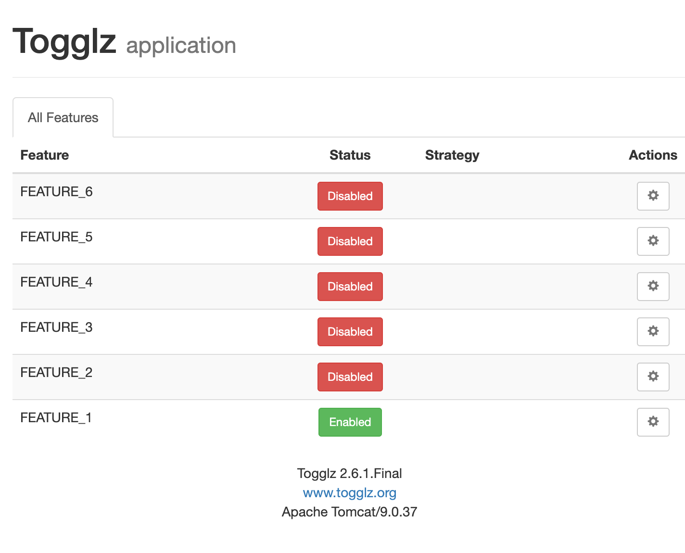

# togglz-demo

## Running
* Start app (./gradlew bootrun or via IDE)
* Navigate to http://localhost:8080/togglz-console/index

Flip the button to turn on/off features.  
Click on the gear icon to see additional settings.

